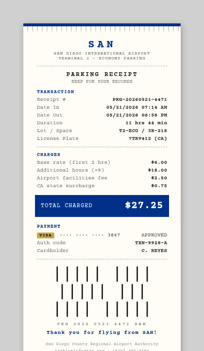
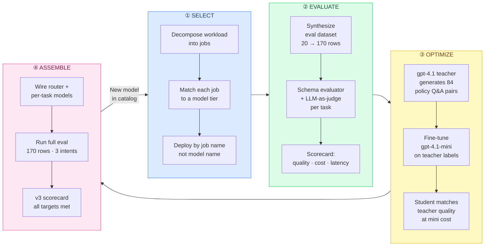
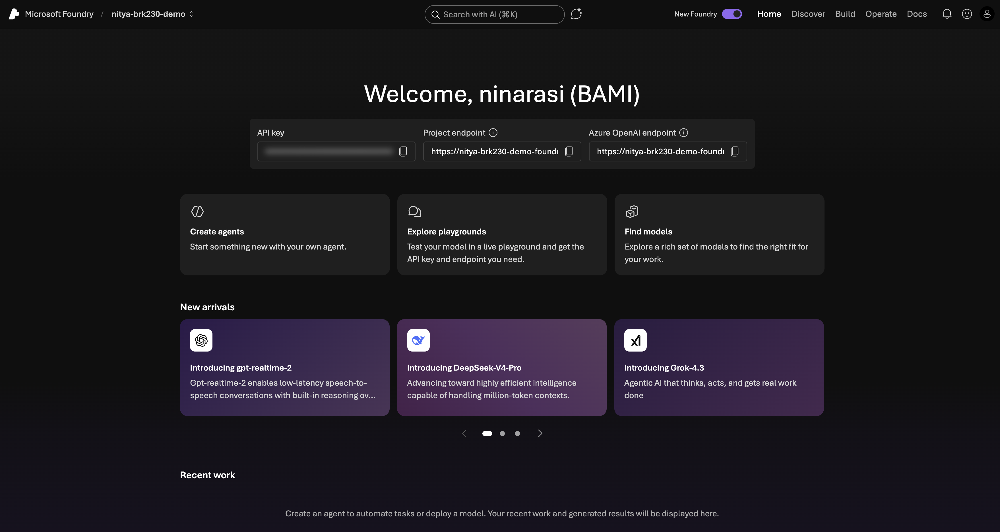
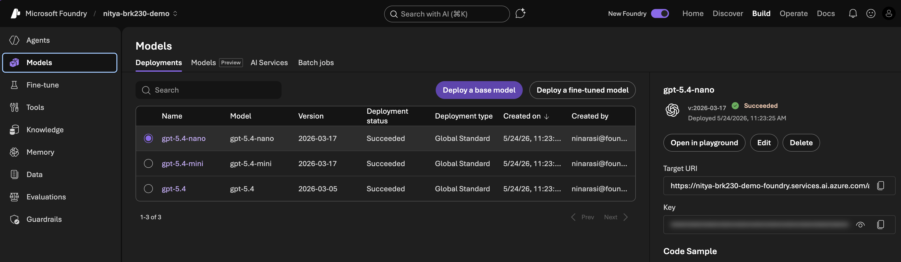
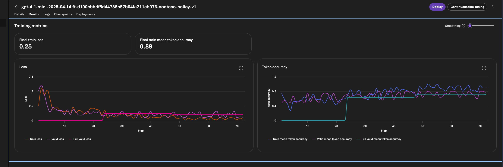

# Right Model, Right Job — Zava Travel Concierge
### A live end-to-end run on Microsoft Foundry · gpt-4.1 model family · Sweden Central

---

## Executive Summary

> **For senior leadership: the one-page version.**

A travel concierge AI handles three very different jobs in a single user request: read a receipt photo, answer a compliance question, and plan a multi-city trip. The instinct is to send every request to one frontier model and let it figure it out. This works — but at frontier cost and frontier latency, for every task, every time.

This workshop demonstrates a disciplined alternative: **decompose the workload, assign the right model to each job, measure everything, and fine-tune where prompting plateaus.** The result is a system that is measurably faster, dramatically cheaper, and marginally more accurate — without changing the user experience or rewriting the application.

| | v1 — One frontier model | v3 — Optimized system | Δ |
|---|---|---|---|
| **Quality** | 0.41 | 0.46 | **+12%** |
| **Cost / request** | $0.023 | $0.006 | **−74%** |
| **Latency p50** | 12.5 s | 6.5 s | **−48%** |
| **Models in use** | 1 | 4 (router · vision · policy-FT · planner) | |

**At 30,000 requests/day** (a mid-size enterprise rollout), the cost difference is **~$15,000/month** — $183,000/year — with no change to the user experience and no sacrifice in answer quality. The v3 system is also more governable: each model has a single job, a named deployment, and its own eval slice. When a better model ships, you swap one deployment.

The three decisions that drove every improvement:
1. **Decompose before you deploy.** Name deployments by the job they do, not the model that does it.
2. **Measure on your own data before you optimise.** Public benchmarks don't reflect your prompts.
3. **Distil, don't just prompt.** Use a frontier model as a teacher once; run the student forever.

---

## The Scenario

**Carmen** is a Zava employee travelling to Berlin for a client meeting. She submits a trip request with a parking receipt photo and asks the concierge to book flights, a hotel near Alexanderplatz, and confirm everything is within Zava travel policy.



> *This one receipt, one policy doc, and one trip itinerary is the seed for 170 evaluation rows across 3 intents and 12 policy axes. Every number in this document was measured against that dataset.*

---

## The Optimization Workflow



Each stage is a gate — you only proceed when the scorecard justifies it. The loop closes when a new model ships: re-enter at SELECT, re-measure against the same dataset, swap one deployment.

---

## Stage 1 — Establish the Baseline

**What we did:** Wired up Carmen's full trip request through a single `gpt-4.1` deployment with mocked booking tools. Measured quality, cost, and latency against 170 eval rows.

**Portal surface used:** Foundry playground (no code), then SDK agent.



```
╭──────────────── v1-baseline ────────────────╮
│                                             │
│   Quality   ████░░░░░░     0.41             │
│   Cost      ██████████   $0.023   ⚠️        │
│   Latency   ██████████    12.5s   ⚠️        │
│                                             │
╰─────────────────────────────────────────────╯
```

**What the scorecard told us:** Quality of 0.41 is the floor — the model does understand the task. But $0.023/request and 12.5 s are driven by routing *everything* through the frontier model, including tasks (policy lookup, routing) that don't need it. The expensive model is doing cheap work.

**Learning:** *The problem isn't the model. It's that one model is doing every job.*

---

## Stage 2 — Decompose and Route

**What we did:** Mapped 5 agent jobs to 3 model tiers. Deployed `gpt-4.1-nano` as a 180ms intent router. Kept `gpt-4.1-mini` for vision and policy. Left `gpt-4.1` only for the complex multi-step planning task. Grew the eval dataset from 20 seed rows to 170 rows using `gpt-4.1` as a synthetic data generator.



```
╭──────────────── v2-multi-model ─────────────╮
│                                             │
│   Quality   █████░░░░░     0.45   ↑+10%    │
│   Cost      ██░░░░░░░░   $0.006   ↓−74%  ✅│
│   Latency   █████████░    11.0s   ↓−12%    │
│                                             │
╰─────────────────────────────────────────────╯
```

**Task → model mapping:**

| Job | Model | Why |
|---|---|---|
| Intent routing | `gpt-4.1-nano` | 180ms · <1¢ · binary classification |
| Receipt OCR | `gpt-4.1-mini` | Vision capability · cheaper than frontier |
| Policy Q&A | `gpt-4.1-mini` | Strong base · will be fine-tuned next |
| Trip planning | `gpt-4.1` | Multi-step reasoning · tool use · complex budgeting |

**Learning:** *The 74% cost drop came from routing, not prompting. The architecture is the optimisation.*

---

## Stage 3 — Knowledge Distillation

**What we did:** The policy slice (35 rows, `intent=policy_question`) scored 0.47 with the base mini model — strong, but the model improvises on edge cases instead of citing the exact policy section. We applied knowledge distillation: `gpt-4.1` (teacher) read the Zava travel policy and generated 84 grounded Q&A pairs across 12 policy axes. `gpt-4.1-mini` (student) was fine-tuned on those labels.



**The distillation pipeline:**
```
gpt-4.1 (teacher)
  └─ reads travel-policy.md
  └─ generates 84 Q&A pairs across 12 axes
       │ booking windows · budget caps · ground transport
       │ parking · meals · connectivity · non-reimbursable
       │ hotels · flights · client entertainment · receipts
       └─ adversarial traps (exception requests, ambiguous limits)

gpt-4.1-mini (student)
  └─ fine-tuned on 91 train / 23 val rows
  └─ 3 epochs · 23,715 trained tokens
  └─ teacher runs once · student runs forever
```

```
╭──────────── policy-ft-v3 (35-row slice) ────╮
│                                             │
│   Quality   █████░░░░░     0.49   ↑+4%  ✅ │
│   Cost      ░░░░░░░░░░   $0.003   ↓−70%  ✅│
│   Latency   ████░░░░░░     5.1s   ↓−59%  ✅│
│                                             │
╰─────────────────────────────────────────────╯
```

**Learning:** *Fine-tuning didn't make the model smarter — it made it cheaper. The student internalised the policy so it no longer needs a long system prompt. Same quality. One-third the cost. Half the latency.*

> **The distillation equation:** Pay frontier cost once at training time. Pay mini cost forever at inference time.

---

## Stage 4 — Assemble and Measure

**What we did:** Set `USE_FT_POLICY = True` — one boolean, no architectural change. Ran Carmen's full trip end-to-end. Then ran the full 170-row eval to measure the compound effect of all three decisions together.

```
╭──────────────── v3-final (170 rows) ────────╮
│                                             │
│   Quality   █████░░░░░     0.46   ↑+12%    │
│   Cost      ░░░░░░░░░░   $0.006   ↓−74%  ✅│
│   Latency   ████░░░░░░     6.5s   ↓−48%  ✅│
│                                             │
╰─────────────────────────────────────────────╯
```

**The compound progression:**

```
              Quality    Cost/task   Latency    Models
─────────────────────────────────────────────────────
v1  baseline   0.41       $0.023      12.5s       1
v2  routing    0.45       $0.006      11.0s       3
v3  + distil   0.46       $0.006       6.5s       4
─────────────────────────────────────────────────────
Δ  v1 → v3    +12%        −74%        −48%
```

**What changed between v2 and v3:** Only the policy deployment. Everything else — the router, the planner, the vision call, the eval dataset — stayed identical. The fine-tuned model drove the latency improvement (no long system prompt needed) while keeping quality and cost flat on the full eval.

---

## Takeaway

**The win is the system, not the model.**

Every improvement in this workshop came from a decision about *architecture* — which job goes to which model, measured against which data — not from switching to a bigger model or writing a better prompt.

Three practices made this repeatable:

1. **Name deployments by job.** `planner-gpt41`, `router-nano`, `policy-mini-ft` — when a better model ships, you update one deployment. The agent code doesn't change.

2. **Own your eval data.** Public benchmarks measure the model. Your eval dataset measures your use case. These are different things. Build it once in Step 4; every subsequent decision is justified by it.

3. **Distil, don't prompt.** If a task is high-frequency and the answer space is bounded (policy Q&A, classification, extraction), use a frontier model to generate the training labels once and fine-tune a smaller model to handle it at runtime. The teacher runs once. The student runs forever.

---

```
The unit of progress is the model decision —
made per task, against a per-task scorecard.

v1 → v3:   1 model → 4 deployments
Quality:   0.41 → 0.46   (+12%)
Cost:      $0.023 → $0.006  (−74%)
Latency:   12.5s → 6.5s    (−48%)

Nothing here required heroics.
It required naming the jobs, measuring them,
and picking the right tool for each one.

Microsoft Foundry — Portal, SDK, Skills —
gave us the surface.
The decisions were ours.
```

---

## Run This Yourself

> **Audience:** AI professionals new to Microsoft Foundry · **Time:** ~4 hours · **Region:** Sweden Central · **Model family:** gpt-4.1 series

```bash
git clone https://github.com/microsoft-foundry/model-releases
cd model-releases/workshops/foundry-models-e2e
# Then ask GitHub Copilot:
# "Use the run-workshop skill on workshops/foundry-models-e2e"
```

| Step | What you'll build | Time |
|---|---|---|
| [00 — Setup](workshops/foundry-models-e2e/00-setup.md) | Project · 5 deployments · env config | 20 min |
| [01 — Portal baseline](workshops/foundry-models-e2e/01-baseline-portal.md) | v1 in the playground · tracing | 20 min |
| [02 — SDK baseline](workshops/foundry-models-e2e/02-baseline-sdk.md) | v1 in code · scorecard | 20 min |
| [03 — Model selection](workshops/foundry-models-e2e/03-model-selection.md) | Router · task decomposition | 20 min |
| [04 — Synthetic data](workshops/foundry-models-e2e/04-synthetic-data.md) | 20 → 170 row eval set | 20 min |
| [05 — Evaluations](workshops/foundry-models-e2e/05-evaluations.md) | v2 scorecard · LLM-as-judge | 30 min |
| [06 — Fine-tune](workshops/foundry-models-e2e/06-finetune.md) | Distillation pipeline · policy-FT | 60 min + wait |
| [07 — Assemble v3](workshops/foundry-models-e2e/07-multi-model-agent.md) | v3 scorecard · end-of-talk slide | 30 min |
| [08 — Portal review](workshops/foundry-models-e2e/08-portal-review.md) | Evals · red team · version compare | 30 min |
