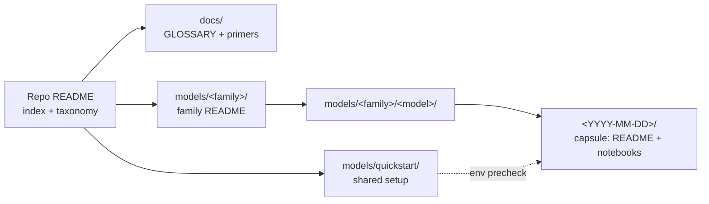
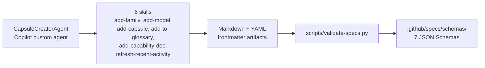

# Microsoft Foundry Model Releases

Microsoft Foundry has a [comprehensive model catalog](https://ai.azure.com/catalog) with thousands of cutting-edge models from leading organizations including Anthropic, Microsoft, OpenAI, x.AI, Hugging Face, Meta, Mistral, Cohere, NVIDIA. 

With new model releases dropping almost daily, it can be hard to keep up with the announcements and get an actionable understanding of what each model release does _differently_ - so you can make an informed decision on model selection for your agentic AI solutions.

This repository is meant to help you address that challenge.

1. Want to know what model releases happened recently? Track the [CHANGELOG](./CHANGELOG.md) and get links to all the announcements in one place.
1. Want to get hands-on experience with a specific model release? Browse the [models/](./models/) tree to find the _model release capsule_ for that announcement - and explore the notebooks to build intuition.
1. Have a specific release you want to learn more about - but can't find the announcement or release capsule? [Post an issue](https://github.com/microsoft-foundry/model-releases/issues/new) and let us know so we can backfill content based on demand.


Get a better understanding of model capabilities and build a model optimization playbook for your needs - helping you identify the right model for the job to meet your desired quality, cost, and latency targets.


<br/>

## Changelog: What's New In Foundry Models?

The [CHANGELOG](./CHANGELOG.md) tracks the model releases with a link to the original announcement, and a glanceable view of the model name, family, capabilities and pricing.
The table below shows the top 3 most recent announcements from that list, for convenience.

<!-- BEGIN:RECENTLY-ADDED -->
| Release date | Model | Description | Expires |
|---|---|---|---|
| [2026-07-23](https://microsoft.ai/news/introducing-mai-image-2-5-pro-and-mai-voice-2-flash/) | [**MAI-Image-2.5-Pro**](models/microsoft-ai/mai-image-2.5-pro/2026-07-23/README.md) | Extends MAI-Image-2.5 with higher portrait quality, accurate text rendering, and spatial reasoning | — |
| [2026-06-02](https://microsoft.ai/news/microsoft-build-2026-mai-keynote-transcript/) | [**MAI-Image-2.5**](models/microsoft-ai/mai-image-2.5/2026-06-02/README.md) | Baseline diffusion model for text-to-image generation and precise image-to-image editing | — |
| [2026-06-02](https://microsoft.ai/news/microsoft-build-2026-mai-keynote-transcript/) | [**MAI-Image-2.5-Flash**](models/microsoft-ai/mai-image-2.5-flash/2026-06-02/README.md) | Production-efficiency variant of MAI-Image-2.5, optimised for throughput at scale | — |

<!-- END:RECENTLY-ADDED -->

<br/>

## Release Capsule: What does the model do?

The _model release capsule_ refers to a folder that has the following components:
1. A Python notebook - providing a hands-on sample showcasing new features.
1. An optional blog - that provides additional insights or resource links.
1. An optional video - that provides a walkthrough of the above two resources.

The capsule gives you an applied understanding of the new model release - helping you answer questions like:
 - What does this release do _differently_ from previous releases in that family?
 - What kinds of _tasks_ should I be considering this model for?
 - What are the _tradeoffs_ (cost, quality, latency) for model optimization?

To get the most value from this, follow the guidance in the [Quickstart](#how-do-i-get-started) section below.

<br/>

## Repository: What resources can I find here?

The repository is meant to be a self-contained resource where you can:
1. Learn about the latest model release announcements (via CHANGELOG)
1. Get hands-on experience with model releases (via `models/` release capsules)
1. Fill gaps in model knowledge with supporting glossary & primers (in `docs/`)

Here is a visual representation of the repository structure for reference:
- the `docs/` folder has a glossary and primers to build familiarity with terminology
- the `models/` folder contains the model release capsules, organized by provider/family.
- the `models/quickstart` folder contains guidance to get started with development.



<br/>

## Quickstart: Explore Model Releases Hands-on

The `models/` folder is organized by _providers_ (first level) and then by model families within that provider. Want to play with the latest model release for a specific model family? Follow these steps for the fastest start:

1. Launch GitHub Codespaces to get a runtime environment to execute notebooks.
1. Complete the `docs/quickstart` section to setup a Foundry project and local `.env`
1. Locate the `models/` subfolder for the desired model provider. Ex: _models/anthropic_.
1. Locate the folder for the desired model in that family. Ex: _models/anthropic/claude_sonnet_.
1. Look for a _model release capsule_ subfolder - named for the specific release.
1. Open the notebook in VS Code - select the kernel and follow instructions to run it.

You can run these notebooks to get familiar with key capabilities by example - then customize the notebooks to explore your own application requirements or scenarios.

<details>

<summary>
<b>🚧 COMING SOON → Use GitHub Copilot with Foundry Skills</b> 
</summary>

<br>
The repository is configured with Azure CLI (`az`), Azure Developer CLI (`azd`) and GitHub Copilot CLI (`copilot`) support by default. This means we can use GitHub Copilot and command-line tools to create, manage, and evolve, our Microsoft Foundry projects - with the power of prompts.
Look for future guidance to support this approach and reduce your development effort even further.


</details>

<br/>

## Learn About: Model families

Models are typically associated with a provider (the organization that created and maintains the model) and belong to a specific _family_ within that scope. Each new release in that family can now describe the advances made (e.g., new features, improved costs or performance) that can help you make a model selection or migration decision. Here are the main model families we will track:

| Family | What it's for | README |
|---|---|---|
| Azure OpenAI | GPT-family models via Foundry | [`models/azure-openai/`](models/azure-openai/) |
| Microsoft AI | Microsoft-built models (Phi, MAI, …) | [`models/microsoft-ai/`](models/microsoft-ai/) |
| Anthropic | Claude family | [`models/anthropic/`](models/anthropic/) |
| Cohere | Command + Embed models | [`models/cohere/`](models/cohere/) |
| Mistral | Mistral / Mixtral / Ministral | [`models/mistral/`](models/mistral/) |
| Model Router | One endpoint, routed to best-fit model | [`models/model-router/`](models/model-router/) |
| Hugging Face | Open-source model catalog | [`models/hugging-face/`](models/hugging-face/) |
| Fireworks | Fast OSS-model inference | [`models/fireworks/`](models/fireworks/) |
| DeepSeek | DeepSeek reasoning + chat models | [`models/deepseek/`](models/deepseek/) |
| xAI | Grok family | [`models/xai/`](models/xai/) |
| Black Forest Labs | FLUX image-generation models | [`models/black-forest-labs/`](models/black-forest-labs/) |
| NVIDIA | NIM microservices for language, vision, biology, and earth science | [`models/nvidia/`](models/nvidia/) |

<br/>

## Learn About: Model Capabilities 

Every capsule is tagged with one or more of these. Names are defined
**once here** and reused everywhere (family READMEs, capsule badges,
CHANGELOG, Recently added).

| Tag | What it means | Primer |
|---|---|---|
| **Chat Completion** | General instruction-following and dialogue. | [chat-completion](docs/primers/chat-completion.md) |
| **Reasoning** | Extended-thinking / chain-of-thought optimized models. | [reasoning-models](docs/primers/reasoning-models.md) |
| **Multimodal** | Accepts image (and/or audio) input alongside text. | [multimodal-models](docs/primers/multimodal-models.md) |
| **Vision** | Image understanding as a primary capability. | [multimodal-models](docs/primers/multimodal-models.md) |
| **Image Generation** | Text → image output. | [image-generation](docs/primers/image-generation.md) |
| **Embeddings** | Vector representations for retrieval / similarity. | [embeddings](docs/primers/embeddings.md) |
| **Audio / Speech** | STT, TTS, or realtime voice. | [audio-speech](docs/primers/audio-speech.md) |
| **Function Calling** | Structured tool invocation. | [function-calling](docs/primers/function-calling.md) |
| **Model Router** | One endpoint that routes requests across models. | [model-router](docs/primers/model-router.md) |
| **Fine-tuning Ready** | Supports customization / distillation. | [fine-tuning](docs/primers/fine-tuning.md) |
| **Long Context** | 200k+ token context window. | [long-context](docs/primers/long-context.md) |

Unsure what a term means? Check the [glossary](docs/GLOSSARY.md).

<br/>

## Contributing: How can I add new content?

Want to add a new capsule, or model family, or model capability or glossary term? The repo is spec-driven - so the easiest way is to use GitHub Copilot and activate the relevant skills with a prompt. This ensures content is validated against the schema and referenced consistently across documents.




1. **Start with the [maintainer guide](.github/maintainer-guide.md)** — it
covers setup validation, how to add your first capsule/family/term, and
the testing strategy.
1. **Activate the CapsuleCreatorAgent** to get a guided experience for content creation. Try this prompt with GitHub Copilot (or switch to the custom agent in GitHub Copilot Chat)

    ```text
    Use the CapsuleCreatorAgent to add a capsule for the (model) released on (date)
    ```
