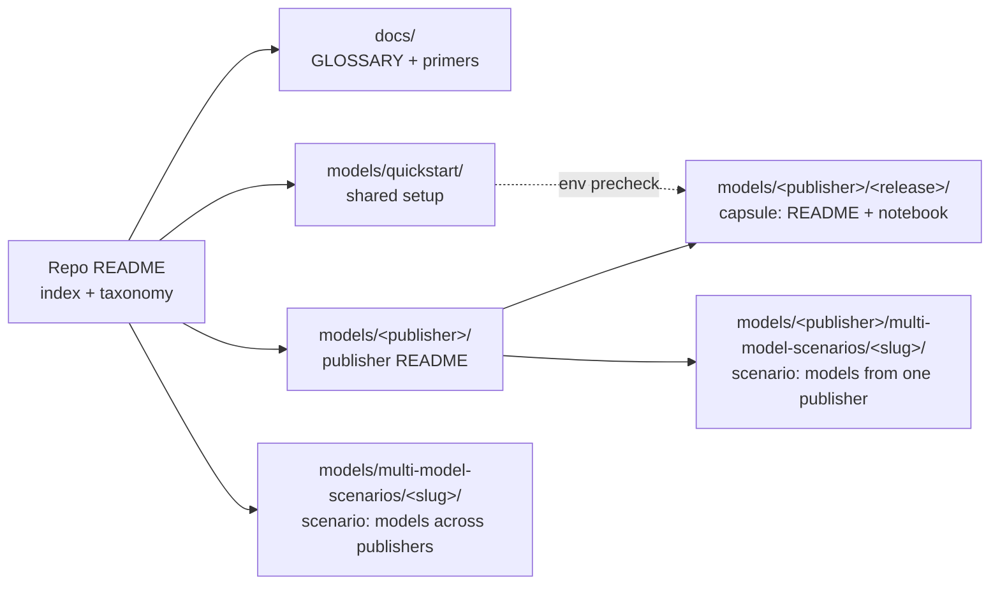
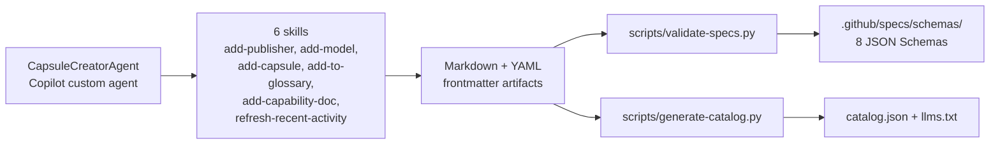

# Microsoft Foundry Model Releases — Reference Guide

Background material for the [Microsoft Foundry Model Releases](../README.md) repo — how it's organized, what the publishers and capability tags mean, and how to add content of your own.

- [Repository: What resources can I find here?](#repository-what-resources-can-i-find-here)
- [Learn About: Publishers](#learn-about-publishers)
- [Learn About: Model capabilities](#learn-about-model-capabilities)
- [Contributing: How can I add new content?](#contributing-how-can-i-add-new-content)
- [Using this repo from an agent](#using-this-repo-from-an-agent)

<br/>

## Repository: What resources can I find here?

The repository is meant to be a self-contained resource where you can:
1. Learn about the latest model release announcements (via [CHANGELOG](../CHANGELOG.md))
1. Get hands-on experience with model releases (via the [CAPSULE-TOC](../CAPSULE-TOC.md) and `models/` release capsules)
1. Fill gaps in model knowledge with supporting glossary & primers (in `docs/`)

Here is a visual representation of the repository structure for reference:
- the `docs/` folder has a glossary and primers to build familiarity with terminology
- the `models/` folder contains the model release capsules, organized by publisher.
- the `models/quickstart` folder contains guidance to get started with development.
- a `multi-model-scenarios/` folder holds walkthroughs that span two or more releases, and its location says which:
  - **under a publisher** (`models/<publisher>/multi-model-scenarios/`) — several models from that one publisher in a single notebook. This is often a deeper technical dive that uses them together, not just a side-by-side comparison.
  - **at the top level** (`models/multi-model-scenarios/`) — models from different publishers in a single notebook.



<br/>

## Learn About: Publishers

A **publisher** is the organization that created and maintains a model — the same grouping the [Foundry catalog](https://ai.azure.com/catalog/models) filters on, so a publisher here matches a `?publisher=` view there. Within a publisher, related releases form a **family** (MAI-Image-2.5 and its Flash and Pro variants, or the Claude family), and each new release records what changed — new capabilities, better costs, stronger benchmarks — to inform a selection or migration decision. We organize `models/` by publisher because that is the axis the catalog, pricing, and access controls all share. Here are the publishers we track. **Catalog** opens that publisher's filtered view in the Foundry catalog; **Capsules** is our folder for it, which only exists once a release has a capsule:

| Publisher | What it's for | Catalog | Capsules |
|---|---|---|---|
| Azure OpenAI | GPT-family models via Foundry | [Browse](https://ai.azure.com/catalog/models?publisher=openai) | [`models/azure-openai/`](../models/azure-openai/) |
| Microsoft AI | Microsoft-built models (Phi, MAI, …) | [Browse](https://ai.azure.com/catalog/models?publisher=microsoft) | [`models/microsoft-ai/`](../models/microsoft-ai/) |
| Anthropic | Claude family | [Browse](https://ai.azure.com/catalog/models?publisher=anthropic) | [`models/anthropic/`](../models/anthropic/) |
| Meta | Llama and Code Llama models | [Browse](https://ai.azure.com/catalog/models?publisher=meta) | _—_ |
| Cohere | Command + Embed models | [Browse](https://ai.azure.com/catalog/models?publisher=cohere) | [`models/cohere/`](../models/cohere/) |
| Mistral | Mistral / Mixtral / Ministral | [Browse](https://ai.azure.com/catalog/models?publisher=mistral%20ai) | [`models/mistral/`](../models/mistral/) |
| Model Router | One endpoint, routed to best-fit model | [Model card](https://ai.azure.com/catalog/models/model-router) | [`models/model-router/`](../models/model-router/) |
| Hugging Face | Open-source model catalog | [Browse](https://ai.azure.com/catalog/models?publisher=hugging%20face) | [`models/hugging-face/`](../models/hugging-face/) |
| Fireworks | Fast OSS-model inference | [Browse](https://ai.azure.com/catalog/models?publisher=fireworks) | [`models/fireworks/`](../models/fireworks/) |
| DeepSeek | DeepSeek reasoning + chat models | [Browse](https://ai.azure.com/catalog/models?publisher=deepseek) | [`models/deepseek/`](../models/deepseek/) |
| xAI | Grok family | [Browse](https://ai.azure.com/catalog/models?publisher=xai) | [`models/xai/`](../models/xai/) |
| Black Forest Labs | FLUX image-generation models | [Browse](https://ai.azure.com/catalog/models?publisher=black%20forest%20labs) | [`models/black-forest-labs/`](../models/black-forest-labs/) |
| NVIDIA | NIM microservices for language, vision, biology, and earth science | [Browse](https://ai.azure.com/catalog/models?publisher=nvidia) | [`models/nvidia/`](../models/nvidia/) |

<br/>

## Learn About: Model capabilities

Every capsule is tagged with one or more of these. The table below is
generated from the `label` and `aliases` fields in `docs/primers/`, so
each primer defines its own display name once and every other surface
(publisher READMEs, capsule badges, CHANGELOG, `CAPSULE-TOC.md`,
`catalog.json`) reuses it. A tag is only valid if some primer declares
it - as its `capability` or in its `aliases` - which is what
`validate-crosslinks.py` enforces.

<!-- BEGIN:CAPABILITY-TAXONOMY -->
| Tag | Capability | What it means | Primer |
| --- | --- | --- | --- |
| `audio-speech` | Audio / Speech | STT, TTS, or realtime voice. | [audio-speech](primers/audio-speech.md) |
| `chat-completion` | Chat Completion | General instruction-following and dialogue. | [chat-completion](primers/chat-completion.md) |
| `embeddings` | Embeddings | Vector representations for retrieval / similarity. | [embeddings](primers/embeddings.md) |
| `fine-tuning` | Fine-tuning Ready | Supports customization / distillation. | [fine-tuning](primers/fine-tuning.md) |
| `function-calling` | Function Calling | Structured tool invocation. | [function-calling](primers/function-calling.md) |
| `image-generation` | Image Generation | Text → image output. | [image-generation](primers/image-generation.md) |
| `long-context` | Long Context | 200k+ token context window. | [long-context](primers/long-context.md) |
| `model-router` | Model Router | One endpoint that routes requests across models. | [model-router](primers/model-router.md) |
| `multimodal` | Multimodal | Accepts image (and/or audio) input alongside text. | [multimodal-models](primers/multimodal-models.md) |
| `reasoning` | Reasoning | Extended-thinking / chain-of-thought optimized models. | [reasoning-models](primers/reasoning-models.md) |
| `vision` | Vision | Image understanding as a primary capability. | [multimodal-models](primers/multimodal-models.md) |
<!-- END:CAPABILITY-TAXONOMY -->

Unsure what a term means? Check the [glossary](GLOSSARY.md).

<br/>

## Contributing: How can I add new content?

Want to add a new capsule, or publisher, or model capability or glossary term? The repo is spec-driven - so the easiest way is to use GitHub Copilot and activate the relevant skills with a prompt. This ensures content is validated against the schema and referenced consistently across documents.



Schemas live centrally in [`.github/specs/schemas/`](../.github/specs/schemas/); each artifact carries only its own data. The rule for what goes where: **frontmatter holds facts a machine needs to index the page, everything a human reads goes in the body.** If a field would only be rendered back out as prose, write the prose instead - that's why references are markdown bullets in `## References` rather than a YAML array.

1. **Start with the [maintainer guide](../.github/maintainer-guide.md)** — it
covers setup validation, how to add your first capsule/publisher/term, and
the testing strategy.
1. **Activate the CapsuleCreatorAgent** to get a guided experience for content creation. Try this prompt with GitHub Copilot (or switch to the custom agent in GitHub Copilot Chat)

    ```text
    Use the CapsuleCreatorAgent to add a capsule for the (model) released on (date)
    ```

<br/>

## Using this repo from an agent

Two generated files let a tool understand the whole catalog in one request, instead of crawling the tree:

| File | Use it for |
|---|---|
| [`catalog.json`](../catalog.json) | Every capsule, scenario, publisher, and primer as structured data - models, capabilities, pricing, notebook paths |
| [`llms.txt`](../llms.txt) | A link-dense markdown map of the repo, per the [/llms.txt convention](https://llmstxt.org/) |

Both are generated by [`scripts/generate-catalog.py`](../scripts/generate-catalog.py) from artifact frontmatter, and `scripts/validate.py` fails if they drift. Never edit them by hand - change the frontmatter and regenerate:

```bash
python scripts/generate-catalog.py
```
