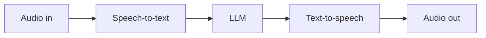

# Audio & Speech Models

> **Hear and speak.** Speech-to-text (STT), text-to-speech (TTS), and
> realtime voice models let your app take voice input and respond in
> natural audio.

## When to reach for it

- Voice assistants, IVR, call-center automation.
- Meeting transcription and summarization.
- Accessibility — captions, screen-reader-friendly voice output.

## When *not* to

- Text-only chat — cheaper and lower latency.
- High-accuracy transcription of specialized jargon without customization —
  consider domain-adapted speech services.

## Learn more

1. [Foundry Models overview](https://learn.microsoft.com/en-us/azure/foundry/concepts/foundry-models-overview)
2. [Azure AI Speech documentation](https://learn.microsoft.com/en-us/azure/ai-services/speech-service/)
3. [Realtime voice patterns on Foundry](https://learn.microsoft.com/en-us/azure/foundry/openai/how-to/realtime-audio)

_New to a term? See the [glossary](../GLOSSARY.md)._
