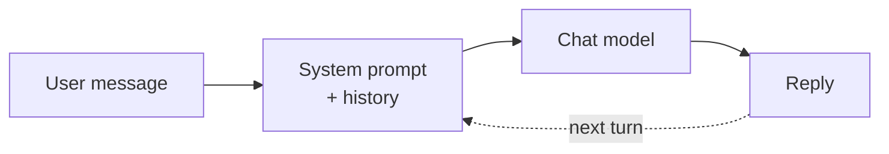

# Chat Completion Models

> **The workhorse.** General instruction-following and dialogue. If you
> can describe what you want in a sentence and expect text back, you're
> in chat-completion territory.

## When to reach for it

- Q&A, summarization, drafting, rewriting.
- Anything where a single well-crafted prompt gets you 80% of the way.
- Baseline before you consider reasoning, tools, or fine-tuning.

## When *not* to

- Multi-step planning with tools → add [Function Calling](function-calling.md).
- Long chain-of-thought math/logic → try a [Reasoning](reasoning-models.md) model.
- Image or audio input → [Multimodal](multimodal-models.md).

## Learn more

1. [Foundry Models overview](https://learn.microsoft.com/en-us/azure/foundry/concepts/foundry-models-overview)
2. [Basic Microsoft Foundry chat reference architecture](https://learn.microsoft.com/en-us/azure/architecture/ai-ml/architecture/basic-microsoft-foundry-chat)
3. [How to use vision-enabled chat models](https://learn.microsoft.com/en-us/azure/foundry/openai/how-to/gpt-with-vision)

_New to a term? See the [glossary](../GLOSSARY.md)._
