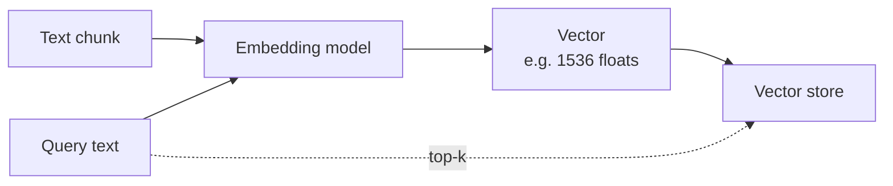

# Embeddings Models

> **Turn text into vectors.** Embeddings are numeric fingerprints of text
> so you can measure similarity, cluster, search, or retrieve — without
> the model generating a word.

## When to reach for it

- Retrieval-Augmented Generation (RAG) over your own documents.
- Semantic search, deduplication, recommendation.
- Clustering / topic discovery on large text corpora.

## When *not* to

- Generating text — pair embeddings with a [Chat](chat-completion.md) or
  [Reasoning](reasoning-models.md) model.
- Tiny corpora — keyword search may be simpler and equally good.
- Highly structured data — SQL / filters beat vectors.

## Learn more

1. [Foundry Models overview](https://learn.microsoft.com/en-us/azure/foundry/concepts/foundry-models-overview)
2. [Basic Microsoft Foundry chat reference architecture (RAG pattern)](https://learn.microsoft.com/en-us/azure/architecture/ai-ml/architecture/basic-microsoft-foundry-chat)
3. [Model leaderboards — compare embedding quality](https://learn.microsoft.com/en-us/azure/foundry/concepts/model-benchmarks)

_New to a term? See the [glossary](../GLOSSARY.md)._
