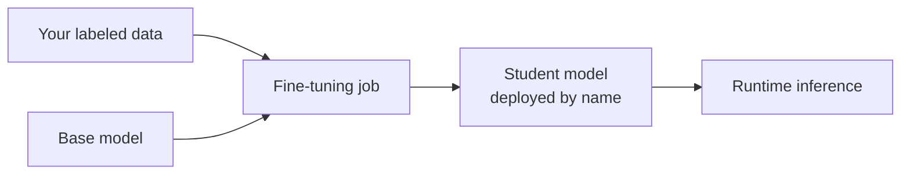

# Fine-tuning Ready Models

> **Teach the model your task.** Some Foundry models can be customized
> with your own labeled examples — pay the training cost once, run a
> cheaper / faster model forever.

## When to reach for it

- High-frequency tasks with a bounded answer space (classification,
  extraction, policy Q&A, style transfer).
- You've plateaued on prompt engineering and need the model to
  *internalize* domain knowledge.
- You want to shrink prompts and cut latency.

## When *not* to

- You don't have (and can't generate) 50+ high-quality examples.
- The task keeps changing — you'll re-fine-tune constantly.
- A retrieval solution (RAG) would work — try that first.

## Learn more

1. [Foundry Models overview — customization](https://learn.microsoft.com/en-us/azure/foundry/concepts/foundry-models-overview)
2. [Model leaderboards — spot fine-tuning-ready options](https://learn.microsoft.com/en-us/azure/foundry/concepts/model-benchmarks)
3. [GPT-5 vs GPT-4.1 model choice guide](https://learn.microsoft.com/en-us/azure/foundry/foundry-models/how-to/model-choice-guide)

_New to a term? See the [glossary](../GLOSSARY.md)._
