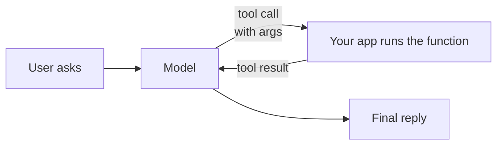

# Function Calling & Tool Use

> **Let the model call your code.** Describe your functions as JSON
> schemas; the model decides when to call them and with what arguments.
> The model never runs your code — it emits a structured call, you run
> it, you feed the result back.

## When to reach for it

- Agent workflows: search, calculate, look up, transact.
- Structured extraction — force the model into a known JSON shape.
- Multi-tool orchestration where you want the model to pick.

## When *not* to

- One-shot completions where deterministic parsing already works.
- Tasks where the model's own knowledge is enough — every tool call
  is another round-trip.

## Learn more

1. [Foundry Models overview — tool use](https://learn.microsoft.com/en-us/azure/foundry/concepts/foundry-models-overview)
2. [Auto and direct model routing with the Responses API](https://learn.microsoft.com/en-us/azure/foundry/openai/how-to/responses-model-routing)
3. [Basic Microsoft Foundry chat reference architecture](https://learn.microsoft.com/en-us/azure/architecture/ai-ml/architecture/basic-microsoft-foundry-chat)

_New to a term? See the [glossary](../GLOSSARY.md)._
