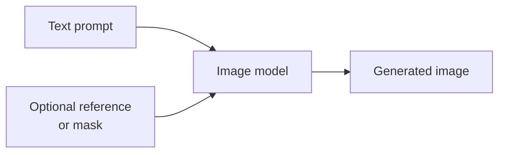

# Image Generation Models

> **Text in, pixels out.** Turn a prompt (and sometimes a reference image
> or mask) into a new image. Great for marketing, mockups, synthetic
> training data, and creative tools.

## When to reach for it

- Marketing / social imagery, hero art, illustrations.
- Rapid design exploration and mockups.
- Data augmentation for downstream vision models.

## When *not* to

- Photorealistic edits of a specific person or product — consider
  editing tools with tighter control.
- Text-heavy graphics (charts, dense typography) — most image models
  still struggle with legible text.
- Regulated content — check safety and licensing policies first.

## Learn more

1. [Foundry Models overview](https://learn.microsoft.com/en-us/azure/foundry/concepts/foundry-models-overview)
2. [Model leaderboards in Microsoft Foundry portal](https://learn.microsoft.com/en-us/azure/foundry/concepts/model-benchmarks)
3. [Explore Microsoft Foundry Models in Azure Machine Learning](https://learn.microsoft.com/en-us/azure/machine-learning/foundry-models-overview?view=azureml-api-2)

_Note: image-generation-specific Learn pages will be added here as the
Foundry catalog grows the FLUX / DALL·E families._

_New to a term? See the [glossary](../GLOSSARY.md)._
