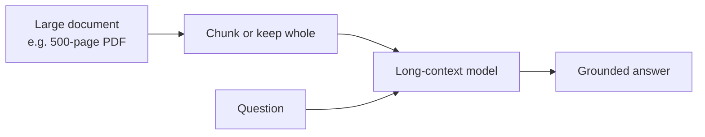

# Long-Context Models

> **Fit the whole thing in the prompt.** Long-context models accept
> hundreds of thousands (sometimes millions) of tokens — enough for
> entire codebases, contract packages, or long transcripts.

## When to reach for it

- One-off analysis of a huge document where RAG feels heavy-handed.
- Whole-repo code understanding.
- Multi-turn agent sessions with long tool traces.

## When *not* to

- Recurring queries — RAG + smaller models is cheaper long-term.
- Latency-sensitive UX — bigger contexts mean slower responses.

## Learn more

1. [Foundry Models overview — context windows](https://learn.microsoft.com/en-us/azure/foundry/concepts/foundry-models-overview)
2. [GPT-5 vs GPT-4.1 model choice guide](https://learn.microsoft.com/en-us/azure/foundry/foundry-models/how-to/model-choice-guide)
3. [Model leaderboards — compare context window sizes](https://learn.microsoft.com/en-us/azure/foundry/concepts/model-benchmarks)

_See also: [context window](../GLOSSARY.md#context-window) in the glossary._
