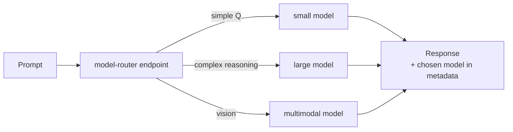

# Model Router

> **One endpoint, best-fit model per request.** Deploy the Foundry model
> router and let it pick the right underlying model for each prompt —
> optimizing for balance, cost, or quality.

## When to reach for it

- Mixed-workload apps where prompts vary widely in complexity.
- Cost / latency optimization without writing custom routing code.
- Fast iteration — swap the routed subset instead of rewriting the app.

## When *not* to

- A single, well-scoped task where one model is clearly right.
- Strict determinism / audit requirements — pin a specific model instead.

## Learn more

1. [Model router for Microsoft Foundry — concepts](https://learn.microsoft.com/en-us/azure/foundry/openai/concepts/model-router)
2. [How to use model router for Microsoft Foundry](https://learn.microsoft.com/en-us/azure/foundry/openai/how-to/model-router)
3. [Auto and direct model routing with the Responses API](https://learn.microsoft.com/en-us/azure/foundry/openai/how-to/responses-model-routing)

_New to a term? See the [glossary](../GLOSSARY.md)._
