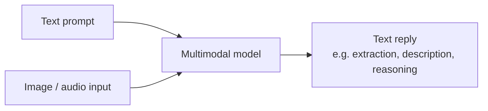

# Multimodal & Vision Models

> **Beyond text.** Multimodal models accept image (and sometimes audio)
> input alongside text. "Vision" is the most common case: describe,
> extract, or reason over what's in a picture.

## When to reach for it

- Reading receipts, screenshots, diagrams, whiteboards.
- Visual QA — "what's wrong with this UI?", "count the items on the shelf".
- Grounded workflows where the source of truth is a picture, not text.

## When *not* to

- Pure text tasks — you'll pay for capability you're not using.
- Generating images — you want [Image Generation](image-generation.md).
- Very long documents where OCR + text-only is cheaper.

## Learn more

1. [How to use vision-enabled chat models](https://learn.microsoft.com/en-us/azure/foundry/openai/how-to/gpt-with-vision)
2. [Foundry Models overview — multimodal in the catalog](https://learn.microsoft.com/en-us/azure/foundry/concepts/foundry-models-overview)
3. [Azure AI Vision documentation (complementary service)](https://learn.microsoft.com/en-us/azure/ai-services/computer-vision/)

_New to a term? See the [glossary](../GLOSSARY.md)._
