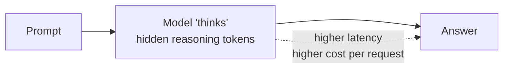

# Reasoning Models

> **Think before you speak.** Reasoning models spend extra compute
> generating a private chain-of-thought before producing the answer.
> They're slower and pricier per token, but they close the gap on
> multi-step logic, math, and code.

## When to reach for it

- Multi-step math, symbolic logic, planning problems.
- Code generation where you need the model to reason about a spec.
- Anywhere a chat model produces confidently-wrong answers on
  problems that require checking work.

## When *not* to

- Short-form chat, classification, extraction — a chat model is faster and cheaper.
- Real-time UX where p50 latency matters more than accuracy.
- High-volume batch tasks — cost adds up quickly.

## Learn more

1. [Azure OpenAI reasoning models — GPT-5 series, o3-mini, o1](https://learn.microsoft.com/en-us/azure/foundry/openai/how-to/reasoning)
2. [GPT-5 vs GPT-4.1: choosing the right model for your use case](https://learn.microsoft.com/en-us/azure/foundry/foundry-models/how-to/model-choice-guide)
3. [Tutorial: Get started with a DeepSeek reasoning model](https://learn.microsoft.com/en-us/azure/foundry/foundry-models/tutorials/get-started-deepseek-r1)

_New to a term? See the [glossary](../GLOSSARY.md)._
